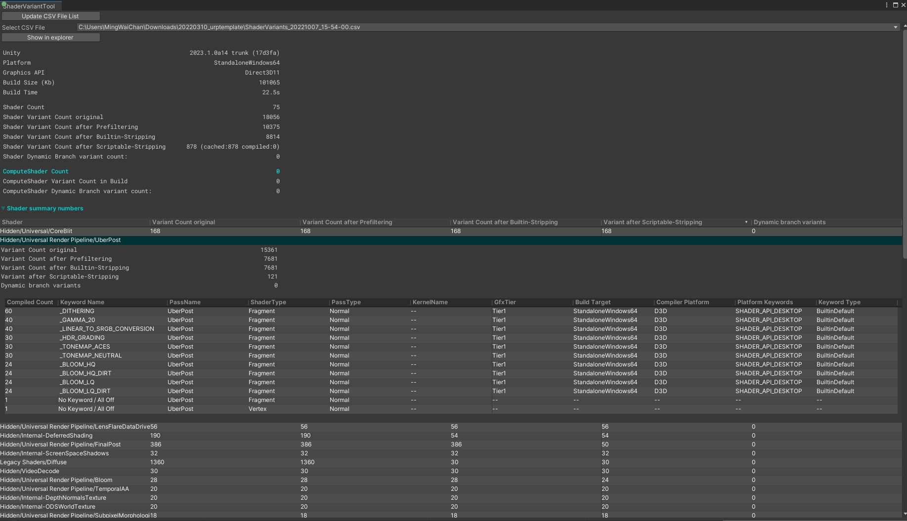

# ShaderVariantTool
This tool lists out all shader keywords and variant counts that are being included in player build and before stripping. \
Expand a shader and see it's keyword table. e.g. If a shader keyword is being completely stripped, the Comiled Count for that keyword should be 0 in the after scriptable stripping column.
\
\
Unity 2022.2.6f1+

### How to install:
1. On Unity Editor > Window > Package Manager
2. On top left, click "+"
3. Select "Add package from git URL..."
4. Copy and paste:
   - For Unity **2022.2.6f1+**: `https://github.com/cinight/ShaderVariantTool.git`
   - For Unity **2021.3.18f1+**: `https://github.com/cinight/ShaderVariantTool.git#2021.3`
5. Click Add
6. OR you can edit Packages/manifest.json and add  `"com.cinight.shader-variant-tool": "https://github.com/cinight/ShaderVariantTool.git",`

### How to use:
1. Make a player build
2. Top menu > Windows > ShaderVariantTool
Note: The tool also generates a .csv file under the project root folder. \
It contains more information and it's useful for keeping a record.
\
\

### FAQ:
1. What is Compiled Count?
   - Each entry on the tool = each keyword in a shader snippet before / after scriptable stripping.
   - The column "Complied Count" = how many variants in that snippet contain this keyword.
2. Shouldn't the tool show all the keywords in every individual variant?
   - In most of my use case, I care more about what keywords are being included (i.e. not stripped) in the build, instead of individual variant, which the keyword list for each variant could be too many/long to look at.
   - If you do need the detailed variant list, use [Project Auditor](https://github.com/Unity-Technologies/ProjectAuditor/blob/master/Documentation~/Installing.md#package-manager-ui-recommended)
3. What are internal / unique program count?
   - internal count = shader variants that are serialized in the player. This count should be equals to the shader variant count after scriptable-stripping. If not, it means a shader has error and thus the problematic shader variant will be skipped.
   - unique count = deduplicated shader variants after shader compilation
4. Please note that for XR there might be more variants added after compilation so the original shader variant count might be less than the shader variant counts after stripping.
